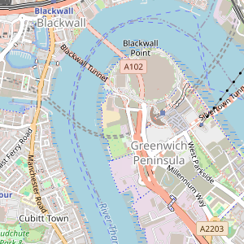
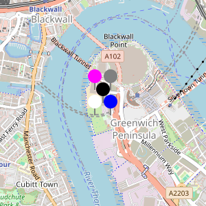
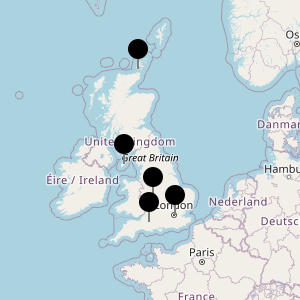
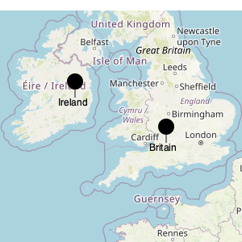

# Swift Static Map

[](https://github.com/fwcd/swift-static-map/actions/workflows/build.yml)
[](https://fwcd.github.io/swift-static-map/documentation/staticmap)

A small library for generating static maps directly from [OpenStreetMap](https://www.openstreetmap.org) tiles.

The implementation is based on a port of [danielalvsaaker](https://github.com/danielalvsaaker)'s [`staticmap`](https://github.com/danielalvsaaker/staticmap) library for Rust.

## Examples

### Simple Map

```swift
StaticMap(center: .init(latitude: 51.5, longitude: 0))
```



### Pins with a Central Location

```swift
StaticMap(
    center: .init(latitude: 51.5, longitude: 0),
    annotations: [
        .pin(coords: .init(latitude: 51.499, longitude: -0.001)).color(.white),
        .pin(coords: .init(latitude: 51.499, longitude: 0.001)).color(.blue),
        .pin(coords: .init(latitude: 51.5, longitude: 0)),
        .pin(coords: .init(latitude: 51.501, longitude: -0.001)).color(.magenta),
        .pin(coords: .init(latitude: 51.501, longitude: 0.001)).color(.gray),
    ]
)
```



### Freely Positioned Pins

```swift
StaticMap(
    annotations: [
        .pin(coords: .init(latitude: 58.8, longitude: -3.3)),
        .pin(coords: .init(latitude: 54.2, longitude: -4.5)),
        .pin(coords: .init(latitude: 52.5, longitude: -1.9)),
        .pin(coords: .init(latitude: 51.1, longitude: -2.3)),
        .pin(coords: .init(latitude: 51.5, longitude: 0.0)),
    ]
)
```



### Labelled Pins

```swift
StaticMap(
    zoom: 5,
    annotations: [
        .pin(coords: .init(latitude: 53, longitude: -7)).label("Ireland"),
        .pin(coords: .init(latitude: 51.5, longitude: -2)).label("Britain"),
    ]
)
```


